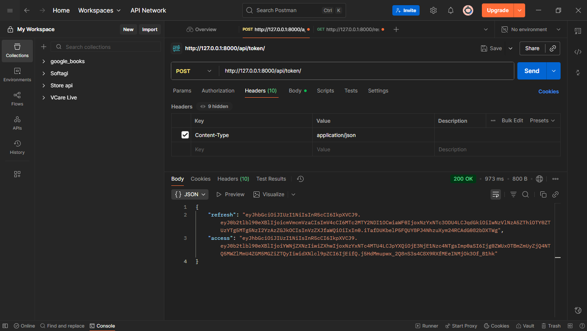
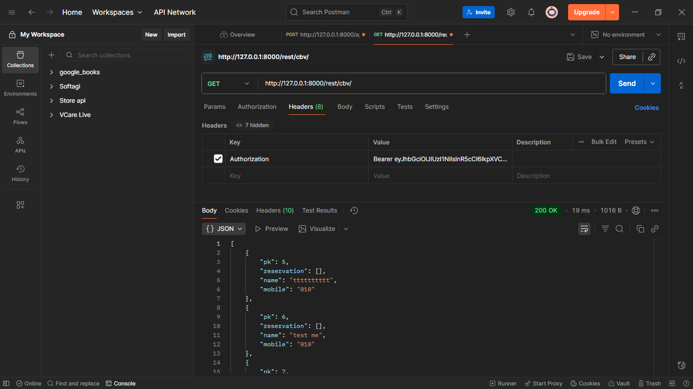

# Cinema Tickets Reservation API

A Django REST Framework API with JWT authentication for managing cinema guests, movies, and reservations.

## Features

- 🔐 **JWT Authentication** - Secure token-based authentication
- 👥 **Guest Management** - CRUD operations for guests
- 🎬 **Movie Management** - Movie and reservation handling
- 🛡️ **Protected Endpoints** - Authentication required for sensitive operations
- 📱 **RESTful API** - Standard REST API design
- 🧪 **Multiple View Types** - Function-based, Class-based, Mixins, Generics, ViewSets

## Quick Start

1. **Install Dependencies**
   ```bash
   pip install django djangorestframework djangorestframework-simplejwt
   ```

2. **Run Server**
   ```bash
   python manage.py runserver
   ```

3. **Access API**
   - API Root: `http://127.0.0.1:8000/`
   - Admin Panel: `http://127.0.0.1:8000/admin/`

## Authentication

### Step 1: Get JWT Token



**Endpoint:** `POST /api/token/`

Use Postman to get your JWT tokens:
- **Method:** POST
- **URL:** `http://127.0.0.1:8000/api/token/`
- **Headers:** `Content-Type: application/json`
- **Body (JSON):**
```json
{
  "username": "admin",
  "password": "password123"
}
```

**Response:** You'll receive both `access` and `refresh` tokens.

### Step 2: Access Protected Data



**Endpoint:** `GET /rest/cbv/`

Use the access token to fetch protected data:
- **Method:** GET
- **URL:** `http://127.0.0.1:8000/rest/cbv/`
- **Headers:** 
  - `Authorization: Bearer YOUR_ACCESS_TOKEN`

**Response:** List of all guests with their details.

## API Endpoints

### Authentication Endpoints
| Method | Endpoint | Description |
|--------|----------|-------------|
| `POST` | `/api/token/` | Get access and refresh tokens |
| `POST` | `/api/token/refresh/` | Refresh access token |

### Protected Endpoints (JWT Required)
| Method | Endpoint | Description |
|--------|----------|-------------|
| `GET` | `/rest/cbv/` | List all guests |
| `POST` | `/rest/cbv/` | Create new guest |
| `GET` | `/rest/cbv/<id>/` | Get specific guest |
| `PUT` | `/rest/cbv/<id>/` | Update guest |
| `DELETE` | `/rest/cbv/<id>/` | Delete guest |

### Public Endpoints
| Method | Endpoint | Description |
|--------|----------|-------------|
| `GET` | `/rest/fbv/` | Function-based view (public) |
| `GET` | `/rest/viewsets/` | ViewSets endpoints |
| `GET` | `/admin/` | Django admin panel |

## Data Models

### Guest
```json
{
  "pk": 5,
  "reservation": [],
  "name": "tttttttttt",
  "mobile": "010"
}
```

### Movie
- Hall number
- Movie name

### Reservation
- Links Guest and Movie
- Manages bookings

## Testing with Postman

### 1. Authentication Flow
1. **Get Token:** POST to `/api/token/` with credentials
2. **Copy Token:** Extract the `access` token from response
3. **Use Token:** Add `Authorization: Bearer <token>` header to requests

### 2. Create New Guest
```json
{
  "name": "John Doe",
  "mobile": "1234567890"
}
```

### 3. Expected Responses
- **Without Authentication:** `401 Unauthorized`
- **With Valid Token:** `200 OK` + data
- **Invalid Token:** `401 Unauthorized`

## Project Structure

```
cinema-tickets-reservation-api/
├── manage.py
├── project/
│   ├── settings.py          # JWT configuration
│   ├── urls.py             # URL routing with JWT endpoints
│   └── ...
├── tickets/
│   ├── models.py           # Guest, Movie, Reservation models
│   ├── views.py            # JWT-protected views
│   ├── serializers.py      # Data serializers
│   └── ...
├── db.sqlite3
└── README.md
```

## Security Features

- ✅ **Token Expiration** - Access tokens expire for security
- ✅ **Refresh Mechanism** - Tokens can be refreshed without re-login
- ✅ **Protected Endpoints** - Sensitive operations require authentication
- ✅ **Standard JWT** - Industry-standard token format

## Development Setup

1. **Create Superuser**
   ```bash
   python manage.py createsuperuser
   ```

2. **Run Migrations**
   ```bash
   python manage.py migrate
   ```

3. **Test Authentication**
   - Use the screenshots above as reference
   - Test with Postman or curl

## Common Use Cases

## Error Handling

| Status Code | Description | Solution |
|-------------|-------------|----------|
| `401` | Unauthorized | Get valid JWT token |
| `403` | Forbidden | Check user permissions |
| `404` | Not Found | Verify endpoint URL |
| `400` | Bad Request | Check request data format |

## Technologies Used

- **Django 5.2.7** - Web framework
- **Django REST Framework** - API framework
- **djangorestframework-simplejwt** - JWT authentication
- **SQLite** - Database (development)

## License

This project is for educational purposes.

---

**Screenshots show successful JWT implementation with Postman testing the authentication flow and protected data access.** 🚀